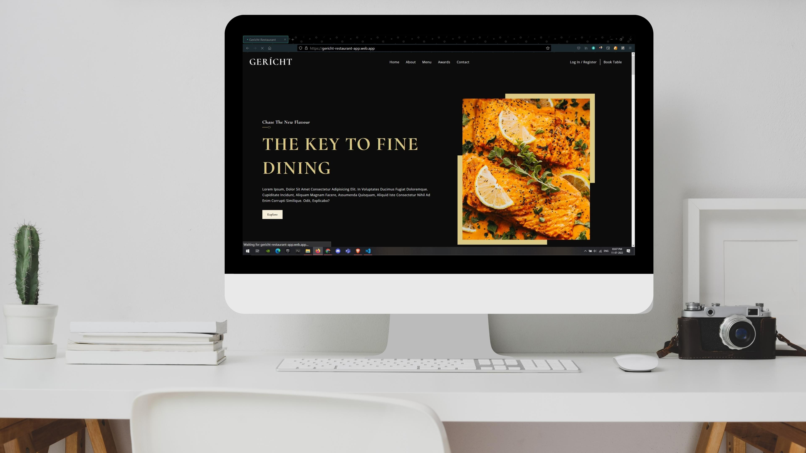
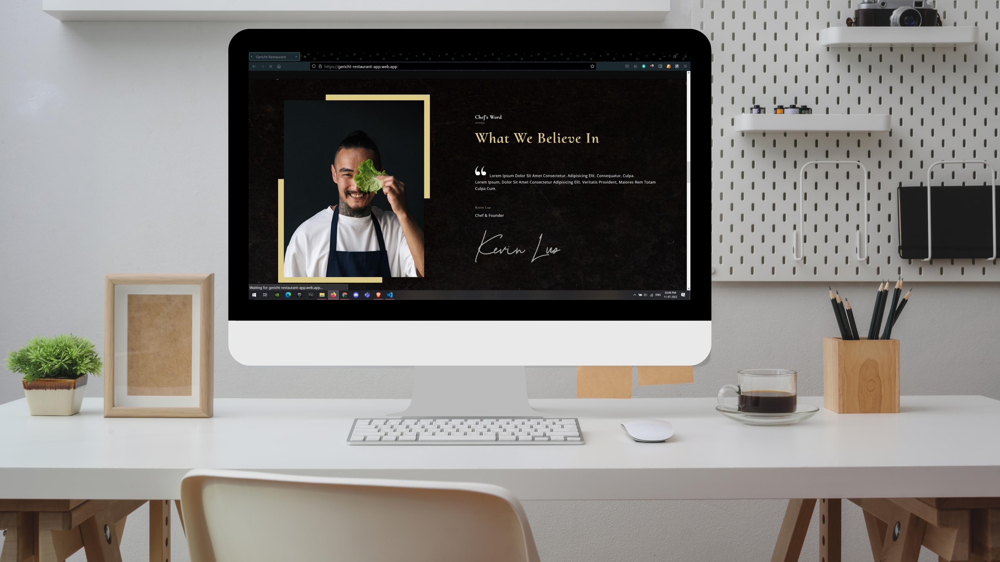

<div align="center">
  
  <h1 align="center">Gericht Restaurant</h1>
</div>

## About:
This is a Front End Project made using React.js. This project is made using an free figma design of a Restaurant Site called Gericht Restaurant. Figma Design link: ttps://www.figma.com/file/yvClSI9AZBRX8UaaGEByF3/Modern-UI%2FUX%3A-Gericht?node-id=53%3A2.

## Screen Shots:
<div align="center">
  
  
  ***
  
  
  
  ***
  
  
</div>

### Steps to Run on Local Machine

***

#### Note: You need to have Node.Js installed in your Local Machine if not, first install it from <a href="https://nodejs.org/en/">here</a>.
##### Step 1) Clone AmanSinghBhogal/Restaurant-App repository.
##### Step 2) Open Restaurant-App cloned Directory in Command Prompt and run the following command (It will install all the Dependencies needed to run):
```
npm i
```
#### Step 3) Once all the dependencies are successfully installed, Run the following Command:
```
npm start
```
#### Step 4) Once the above steps are done you should get the message:
    You can now view client in the browser.
      Local:            http://localhost:3000 
      webpack compiled successfully
#### Step 5) Open Browser and go to http://localhost:3000

***
<h1 align="center">Thank You</h1>
